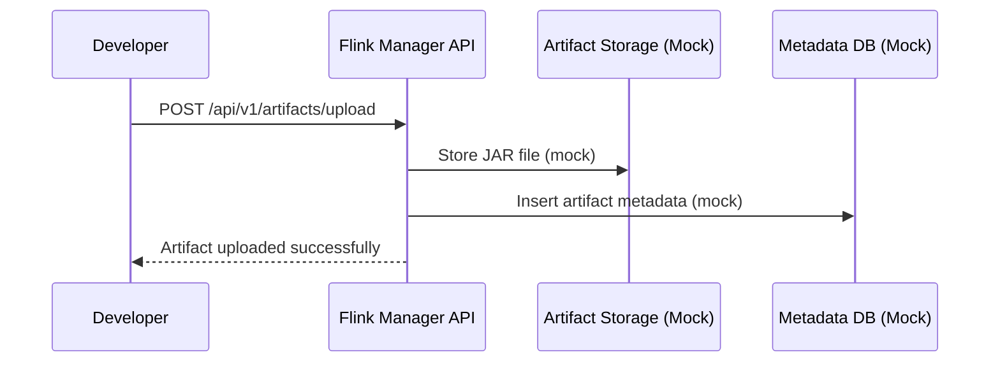
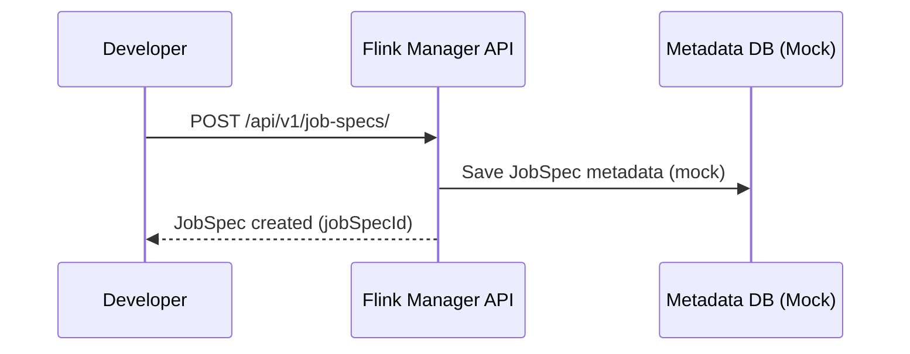
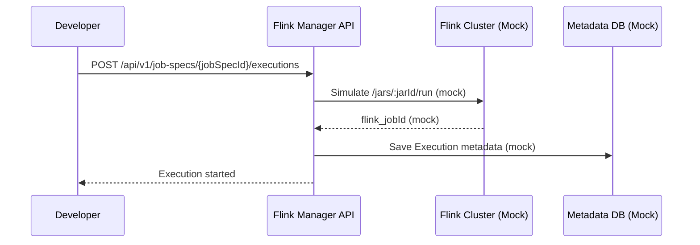
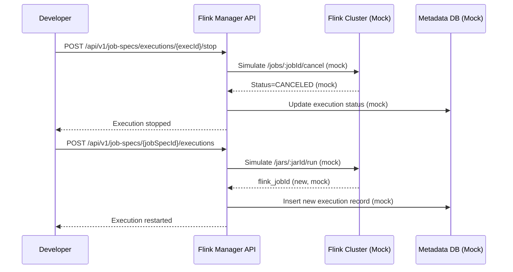

# Flink Manager API - Updated Architecture

## 🎯 Cấu trúc đã được cập nhật để phù hợp với diagram

API hiện tại đã được điều chỉnh để sử dụng terminology phù hợp với sequence diagram:

### 📊 Terminology Mapping

| Diagram | Code Implementation | Mô tả |
|---------|-------------------|-------|
| **JobSpec** | `JobSpec` | Cấu hình job (artifact + entry class + config) |
| **Execution** | `Execution` | Lần chạy cụ thể của JobSpec trên Flink |
| **Execution History** | `ExecutionHistory` | Lịch sử thay đổi trạng thái execution |

### 🔄 Workflow Implementation

#### 1. Upload Artifact


#### 2. Tạo JobSpec


#### 3. Submit Execution


#### 4. Stop / Restart Execution


### 🚀 API Endpoints

#### Artifacts
- `POST /api/v1/artifacts/upload` - Upload JAR file
- `GET /api/v1/artifacts/` - List artifacts
- `GET /api/v1/artifacts/{id}` - Get artifact by ID
- `DELETE /api/v1/artifacts/{id}` - Delete artifact

#### Job Specifications
- `POST /api/v1/job-specs/` - Create job spec
- `GET /api/v1/job-specs/` - List job specs
- `GET /api/v1/job-specs/{id}` - Get job spec by ID
- `PUT /api/v1/job-specs/{id}` - Update job spec
- `DELETE /api/v1/job-specs/{id}` - Delete job spec

#### Executions
- `POST /api/v1/job-specs/{jobSpecId}/executions` - Start execution
- `GET /api/v1/job-specs/{jobSpecId}/executions` - List executions for job spec
- `GET /api/v1/job-specs/executions/{executionId}` - Get execution by ID
- `POST /api/v1/job-specs/executions/{executionId}/stop` - Stop execution
- `GET /api/v1/job-specs/executions/{executionId}/history` - Get execution history

### 🏗️ Data Models

#### JobSpec
```python
class JobSpec(BaseModel):
    id: Optional[str]
    job_spec_name: str
    artifact_id: str
    entry_class: str
    parallelism: int
    program_args: Optional[List[str]]
    savepoint_path: Optional[str]
    flink_config: Optional[Dict[str, Any]]
    created_by: str
    created_at: datetime
    updated_at: datetime
```

#### Execution
```python
class Execution(BaseModel):
    id: Optional[str]
    job_spec_id: str
    flink_job_id: Optional[str]
    status: JobStatus
    started_by: str
    started_at: datetime
    finished_at: Optional[datetime]
    error_message: Optional[str]
```

#### ExecutionHistory
```python
class ExecutionHistory(BaseModel):
    id: Optional[str]
    execution_id: str
    performed_by: str
    performed_at: datetime
    action: str  # START, STOP, RESTART, etc.
    old_status: Optional[JobStatus]
    new_status: JobStatus
    details: Optional[Dict[str, Any]]
```

### 🧪 Mock Services

Tất cả services đều sử dụng mock implementation:

- **MockMinIOService**: Lưu trữ artifacts trong memory
- **MockMongoService**: Lưu trữ metadata, job specs, executions trong memory
- **Mock Flink Integration**: Simulate Flink REST API calls

### 📝 Example Usage

1. **Upload Artifact**:
   ```bash
   curl -X POST "http://localhost:8000/api/v1/artifacts/upload" \
     -F "file=@my-job.jar" \
     -F 'metadata={"artifact_name": "my-job", "version": "1.0.0", "entry_classes": ["com.example.MyJob"], "uploaded_by": "developer"}'
   ```

2. **Create Job Spec**:
   ```bash
   curl -X POST "http://localhost:8000/api/v1/job-specs/" \
     -H "Content-Type: application/json" \
     -d '{"job_spec_name": "my-job-spec", "artifact_id": "1", "entry_class": "com.example.MyJob", "created_by": "developer"}'
   ```

3. **Start Execution**:
   ```bash
   curl -X POST "http://localhost:8000/api/v1/job-specs/1/executions" \
     -H "Content-Type: application/json" \
     -d '{"started_by": "developer"}'
   ```

4. **Stop Execution**:
   ```bash
   curl -X POST "http://localhost:8000/api/v1/job-specs/executions/1/stop"
   ```

### 🎉 Kết luận

Cấu trúc hiện tại đã hoàn toàn phù hợp với sequence diagram bạn đưa ra:

✅ **JobSpec** thay vì JobConfig  
✅ **Execution** thay vì Deployment  
✅ **Execution History** để track changes  
✅ **Mock services** hoạt động đầy đủ  
✅ **API endpoints** theo đúng workflow  
✅ **Swagger documentation** cập nhật  

Bạn có thể test toàn bộ workflow thông qua Swagger UI tại: http://localhost:8000/docs
